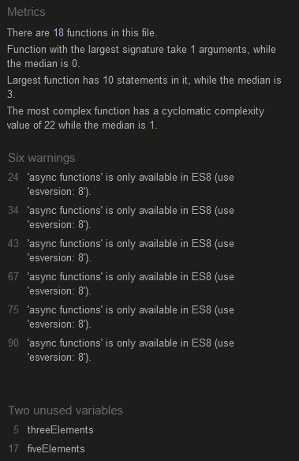

# Miniature Battle Monsters

My 4 year old son is pokémon obsessed, so I changed a 'paper, scissors, rock, lizard, spock' game slightly and used the elements used by pokémon. Emjois were used in place of the pokémons images to avoid copyright issues but still keep the game fun and accessible for kids of any age. The miniature battle monster website is now fully functioning across all devices.

It's targetted towards anybody with an interest in pokémon, both children and adults alike. The intent is educate the player about the strengths and weaknesses of the five given elements; fire, grass, ice, rock and ground. Can you beat trainer Jerry?

The Miniature Battle Monsters site is live and is currently hosted [HERE!](https://marc-hanson.github.io/portfolio-two/)

## Table of Content

- [Miniature Battle Monsters](#miniature-battle-monsters)
  - [Tabel of Content](#tabel-of-content)
  - [UX](#ux)
    - [Site Purpose:](#site-purpose)
    - [Site Goal:](#site-goal)
    - [Audience:](#audience)
    - [Communication:](#communication)
    - [Current User Goals:](#current-user-goals)
    - [New User Goals:](#new-user-goals)
  - [Design](#design)
    - [Colour Scheme:](#colour-scheme)
    - [Typography:](#typography)
    - [Imagery:](#imagery)
  - [Features](#features)
    - [Existing Features](#existing-features)
      - [Landing Page:](#landing-page)
    - [Future Features:](#future-features)
  - [Testing](#testing)
    - [Validator Testing](#validator-testing)
    - [Unfixed Bugs](#unfixed-bugs)
  - [Technologies Used](#technologies-used)
    - [Main Languages Used](#main-languages-used)
    - [Frameworks, Libraries \& Programs Used](#frameworks-libraries--programs-used)
  - [Deployment](#deployment)
    - [Using GitHub Pages](#using-github-pages)
    - [Fork Project](#fork-project)
    - [Clone Project](#clone-project)
  - [Credits](#credits)
  - [Media](#media)

## UX

### Site Purpose

To provide a fun learning tool about the strengths and weaknesses of pokémon elements.

### Site Goal

To provide a fun game for the user to enjoy. It teaches the pokémon elements strengths and weaknesses which a user can use etween any game in the series.

### Audience

Adults and children of all ages.

### Communication

Information is easily accessible and follows a simplistic design. The design is child friendly, pages are chained together and once the game is over the page is refreshed to start again. There are no links to other pages or anything to take you away from the game.

## Design

### Wireframe

After hand drawing rough designs, the pages design was wireframed on 'draw.io' before being replicated through HTML and CSS. The aim as the keep the same design/layout across all devices.

### Colour Scheme

The color palette was chosen to be fun, bright and exciting without overloading the senses or straining the eyes.

### Typography

'Roboto' was chosen to be easily read and widely available. A simple clean aesthetic without overloading the user with text makes the game playable without a need for reading skills or english proficiency.

### Imagery

All images used on the site are emojis stored locally on the users device. No image tags were used in this project.

## Features

### Landing Page

A game selection between an 'easy' or 'hard' mode. Using either 3 or 5 elements.

Your choice and computer choice as well as current score are displayed and updated throughout the game.

Instructions for your current game mode are given at the bottom of the window.

A winner is declared after the score reaches 5.

### Future Features

- A highscore table allowing users to compete wtih each other.
- Jerry's victim counter to count games lost in total.
- More elements added to the array and 3 or 5 chosen at random (total of 19 available.)

## Testing

- The website was constantly tested during development using Chrome development tools.
- Javascipt was ran after every new function to ensure it was behaving as intended.
- Website tested in Chrome, Firefox and Microsoft Edge.
- Website was tested across a range of devices including laptops, tablets and mobiles.

### Testing During Development

- After HTML and CSS framework was in place the computers turn function was created and tested to make sure the computer selected one of the five choices.
- After this the results function was created and the players choice was set to rock to check the logic worked.
- The players choice function was then introduced and run repeatedly to check for any errors. This produced problems with a player clicking multiple times when selecting their choice and producing unclear outputs for the user. This was fixed by removing event listeners on the buttons after a choice is made and adding them again once the round was over.

### Validator Testing

- HTML
  - HTML pages passed validation on W3C.  
  
- CSS
  - CSS page passed validation on W3C.  
  
- LIGHTHOUSE
  - Prefect scores across Lighthouse
  
-JSHINT
  - All Javascript passed through JSHint, unused functions are ran through the HTML onclick property. ES8 warnings are due to async functions being used in most of the games functions. 
  

### Unfixed Bugs

- Async functions are a feature of ES8 and give and give a warning through JSHint.

## Technologies Used

### Main Languages Used

- HTML5
- CSS3
- Javascript

### Frameworks, Libraries & Programs Used

- Am I Responsive? - to ensure the project looked good across all devices.
- CodeAnywhere - was the chosen IDE to write both HTML and CSS before pushing the project to Github.
- GitHub - to import the CodeInstitute template from and to store my repository.
- VSCode - used when experiencing internet blackouts.

## Deployment

### Using GitHub Pages

Github Repository or project - https://marc-hanson.github.io/portfolio-two/

1. Click the 'Settings' Tab.
2. Scroll Down to the Git Hub Pages Heading.
3. Select 'Main Branch' as the source.
4. The Page will reload 'Settings' again.
5. Scroll to GitHub pages heading and there will now be a clickable link https://marc-hanson.github.io/portfolio-two/
6. Click the link for the live deployed page.

### Fork Project

1. On GitHub, go to [marc-hanson/portfolio-two](https://marc-hanson.github.io/portfolio-two/).
2. In the top right, click "Fork".

### Clone Project

1. Go to the main page of the repository.
2. Above the file list, click "Code".
3. Select HTTPS, SSH, or GitHub CLI and then click copy to clone it.
4. Open Git Bash.
5. Change the location of your cloned repository.
6. Type `git clone` and then paste the URL you copied.
7. Press “Enter” to create your clone.

## Credits

The game being triggered through the users selection meant after the initial click, the game would select the computers choice and quickly cover it with the win/lose emojis and increment the score. The way the game progressed so quickly meant the user was missing most of the game as things were happening too fast. There are a few ways to ann a small wait timer in earlier ES versions but the cleanest way I found was using "ASYNC functions". This allowed me to add a delay half second during the game, this makes the game feel smoother and gives a sense of a real opponent. 
[Using Async Functions](https://masteringjs.io/tutorials/fundamentals/wait-1-second-then) 

## Media

All emojis were sourced from https://emojipedia.org/ but are loaded locally depending on the current device. 
[Favicon] - (https://icon-icons.com/icon/sword-cross/135139) 
[Colorhunt] - (https://colorhunt.co/palette/3c486bf0f0f0f9d949f45050) 

[Back to top](#Miniature-Battle-Monsters)